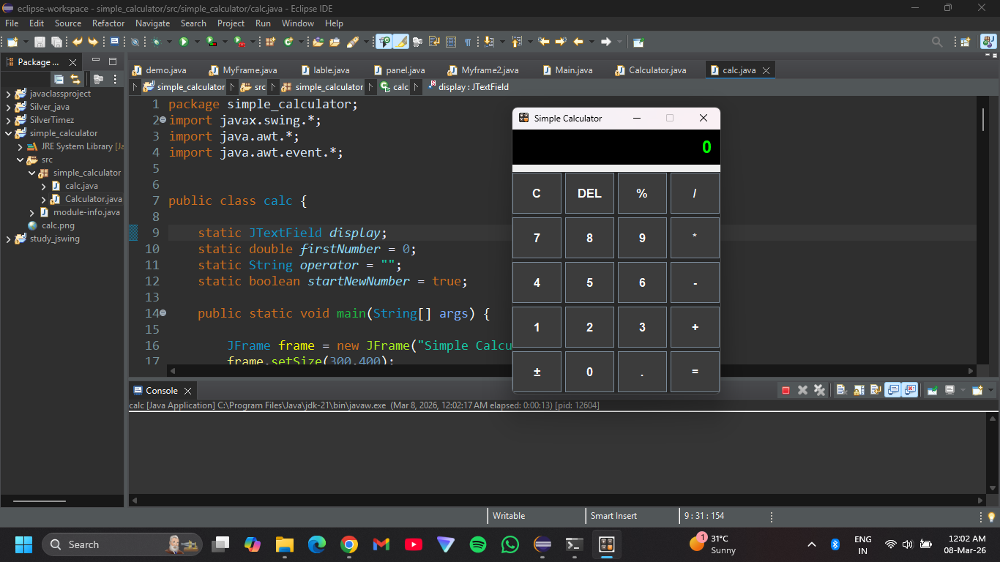

# 🧮 Java Swing Basic Calculator

A clean and lightweight **desktop calculator built using Java Swing**.
This project demonstrates how to design a graphical user interface (GUI) in Java while implementing core arithmetic operations with an intuitive layout.

Designed as a beginner-friendly project to explore **Java GUI development, event handling, and user interface design**.

---

## 📸 Screenshot



---

## ✨ Key Features

* 🔢 **Basic Arithmetic Operations**
  Supports addition, subtraction, multiplication, and division.

* ➗ **Percentage Calculation**
  Quickly compute percentages for everyday calculations.

* 🔄 **Sign Toggle (+ / −)**
  Switch numbers between positive and negative instantly.

* 🧹 **Clear & Reset Functionality**
  Reset calculations smoothly with a clean interface.

* 🖥️ **Simple and Responsive UI**
  Built using **Java Swing components** for a smooth desktop experience.

* 🎨 **Custom Styled Buttons and Layout**
  Structured layout for better usability and readability.

---

## 🛠️ Built With

* **Java**
* **Java Swing**
* **AWT Event Handling**

---

## 📂 Project Structure

```
Java_Swing_Basic_Calculator
│
├── Calculator.java      # Main application source code
├── calc_icon.png        # Caculator icon
├── screenshot.png       # UI preview image
└── README.md            # Project documentation

```

---

## 🎯 Learning Objectives

This project was built to practice:

* Java GUI development using **Swing**
* Handling **button events and user input**
* Structuring **desktop applications**
* Managing **basic arithmetic logic**

---

##  Author

**Mohith M**

GitHub:
https://github.com/Mohith-M-2004

---

## ⭐ If you like this project

Consider giving it a **star ⭐ on GitHub**.
It helps others discover the project and motivates me in making improvements and building new projects.

